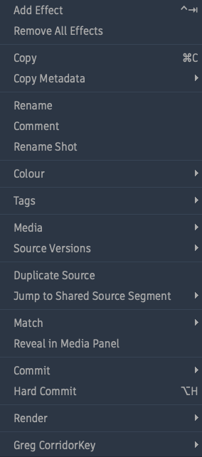

# Greg CorridorKey Flame Tools v0.3.0

First public package for the Flame/EZ-CorridorKey integration.

## Included Assets

- `GregCorridorKeyFlame-0.3.0.pkg`
  - Installs the Flame Python hook, Matchbox package, and setup helpers.
  - Automatically opens Terminal to install or update EZ-CorridorKey as the logged-in user.
- `GregCorridorKeyFlame-Uninstall-0.3.0.pkg`
  - Removes the Flame hook, Matchbox package, and installer support files.
  - Leaves `/Users/Shared/GregCorridorKey` intact so downloaded models and shot outputs are not accidentally deleted.
- `README_GregCorridorKeyFlame.txt`
  - Short install notes for end users.

## Compatibility

- Apple Silicon Mac only: M1 or newer
- Autodesk Flame 2023 or newer
- Tested primarily on Flame 2026.2

## Important Notes

- Packages are unsigned.
- First install can take a while because EZ-CorridorKey downloads Python packages and model weights.
- Users should restart Flame or run `Rescan Python Hooks` after setup completes.
- After installation, `Greg CorridorKey` appears in Flame's right-click menu on supported timeline clips/segments.
- ML key processing time depends on Mac speed, Apple Silicon generation, available unified memory, shot length, and resolution.

## Flame Menu

## Credits

- **CorridorKey** was created by [Niko Pueringer](https://github.com/nikopueringer) / Corridor Digital, the team behind Corridor Crew. This Flame installer builds on their original AI chroma keyer.
- **EZ-CorridorKey** is maintained by [Ed Zisk](https://www.edzisk.com) / [EZSCAPE](https://www.ezscape.space), who created the GUI/workflow layer and Apple Silicon-friendly install path used here.
- **Greg CorridorKey Flame Tools** packages the Flame hook, Matchbox companion, and macOS installer workflow for Autodesk Flame users.

Please support the upstream projects:

- [CorridorKey](https://github.com/nikopueringer/CorridorKey)
- [EZ-CorridorKey](https://github.com/edenaion/EZ-CorridorKey)
